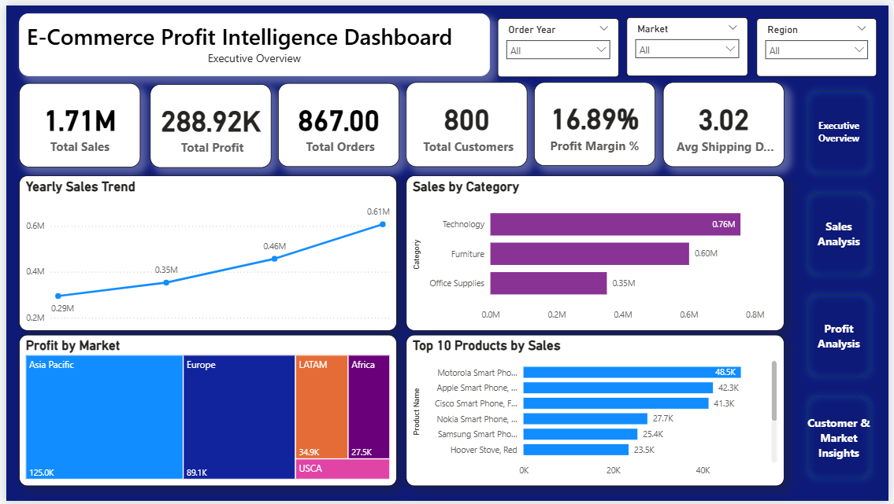
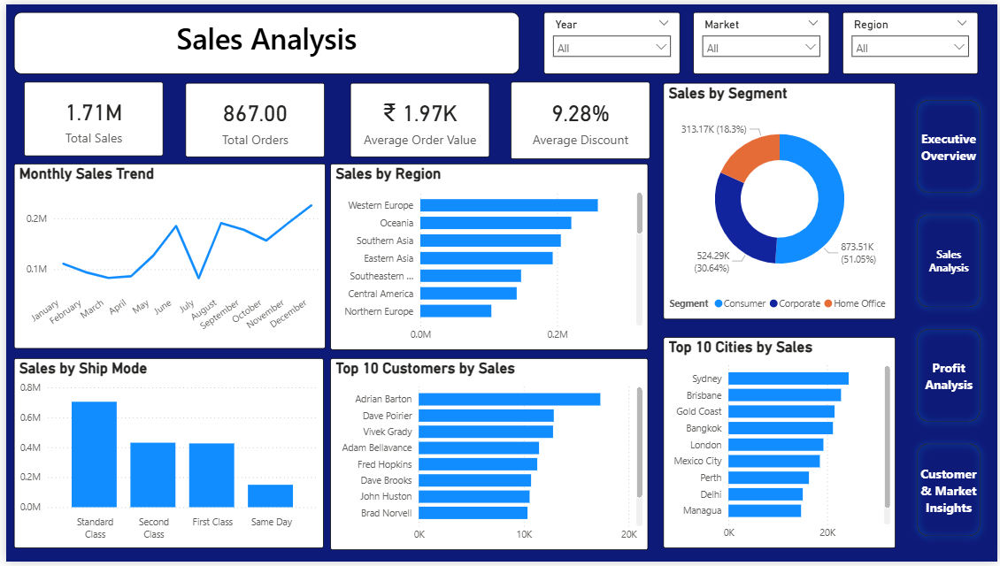
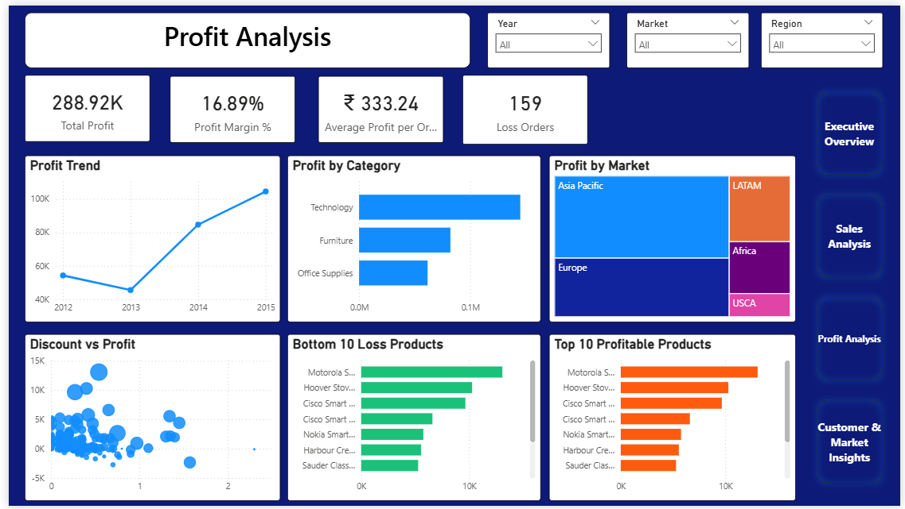
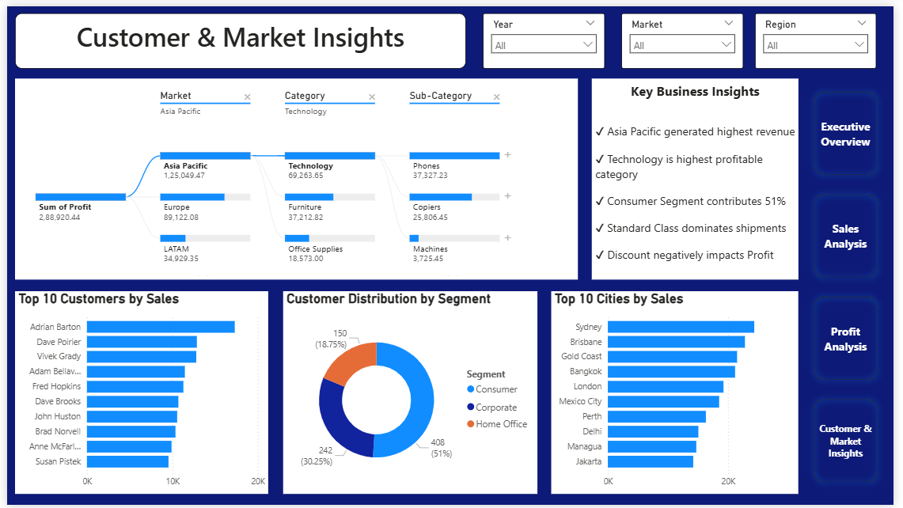

# 📊 E-Commerce Profit Intelligence Dashboard

An end-to-end Data Analytics & Business Intelligence project built using Python, MySQL, Power BI, and DAX.

# Tech Badges ⭐

# About the Project

This project analyzes the Global Superstore dataset to uncover insights into sales performance, profitability, customer behavior, and market trends.

The project follows a complete analytics workflow—from cleaning raw data in Python, validating and analyzing it using MySQL, to building an interactive Power BI dashboard with DAX measures.

The objective is to transform raw business data into meaningful insights that support better decision-making.

# Project Workflow

- Raw Dataset
- Data Cleaning (Python)
- Data Validation (MySQL)
- Exploratory Data Analysis (EDA)
- KPI & DAX Measure Creation
- Interactive Power BI Dashboard
- Business Insights & Recommendations

# Tools & Technologies

- Python
- Pandas
- NumPy
- MySQL
- SQL
- Power BI
- DAX
- Git & GitHub

# Project Structure

E-Commerce-Profit-Intelligence-Dashboard/
│
├── PowerBI/
│   └── E-Commerce_Profit_Intelligence_Dashboard.pbix
│
├── Dataset/
│   └── Global_Superstore_cleaned.csv
│
├── Python/
│   └── Global_Superstore_Analysis.ipynb
│
├── SQL/
│   ├── 01_Data_Validation.sql
│   ├── 02_Exploratory_Data_Analysis.sql
│   ├── 03_Sales_Analysis.sql
│   ├── 04_Profit_Analysis.sql
│   ├── 05_Customer_Analysis.sql
│   └── 06_Business_Insights.sql
│
├── Images/
│   ├── Executive_Overview.png
│   ├── Sales_Analysis.png
│   ├── Profit_Analysis.png
│   └── Customer_Market_Insights.png
│
└── README.md

# Key Features

- Cleaned and transformed raw data using Python.
- Performed SQL-based data validation and exploratory analysis.
- Built reusable DAX measures for KPIs.
- Designed a 4-page interactive Power BI dashboard.
- Added dynamic slicers and page navigation.
- Analyzed sales, profit, customers, products, and markets.
- Generated business insights to support strategic decisions.

# Dashboard Preview

## 📈 1. Executive Overview

## 📊 2. Sales Analysis

## 💰 3. Profit Analysis

## 👥 4. Customer & Market Insights

# Skills Demonstrated

- Data Cleaning
- Data Validation
- SQL Query Writing
- Exploratory Data Analysis
- DAX Measures
- Dashboard Design
- Data Visualization
- Business Intelligence
- Business Storytelling

# Key KPIs

| KPI               |       Value |
| ----------------- | ----------: |
| Total Sales       |     1.71M   |
| Total Profit      |   288.92K   |
| Total Orders      |      867    |
| Total Customers   |      800    |
| Profit Margin     |    16.89%   |
| Avg Shipping Days |     3.02    |

# Business Insights

- Technology generated the highest overall sales.
- Asia Pacific emerged as the most profitable market.
- Consumer segment contributed the largest customer base.
- Sales showed a steady upward trend between 2012–2015.
- Higher discounts generally reduced profitability.
- Standard Class was the most commonly used shipping mode.
- A small group of customers generated a significant portion of total revenue.

# Future Improvements

- Add Year-over-Year (YoY) Analysis

- Publish dashboard to Power BI Service

- Connect to live SQL database

- Add Drill-through Pages

- Add Forecasting & Predictive Analytics

- Implement Row-Level Security (RLS)

# Project Documents

- 📑 SQL Analysis Scripts
- 📊 Power BI Dashboard (.pbix)
- 🐍 Python Data Cleaning Notebook
- 📸 Dashboard Screenshots

# Author

Uzma Khan

Aspiring Data Analyst

# Contact

GitHub:
https://github.com/Uzma-Khan-Tech16

Email:
(uzmak1735@gmail.com)

# License

This project is intended for educational and portfolio purposes.